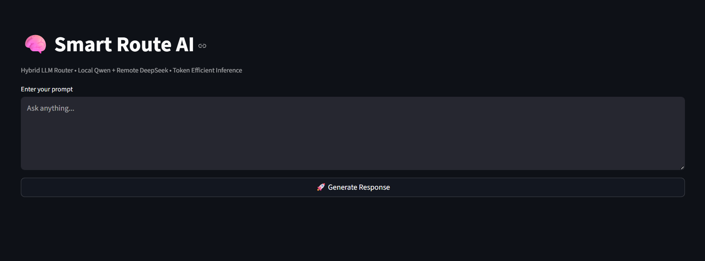
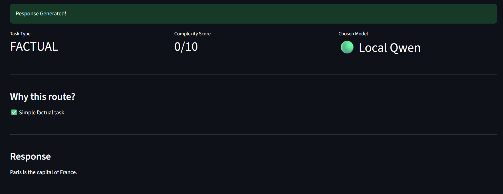
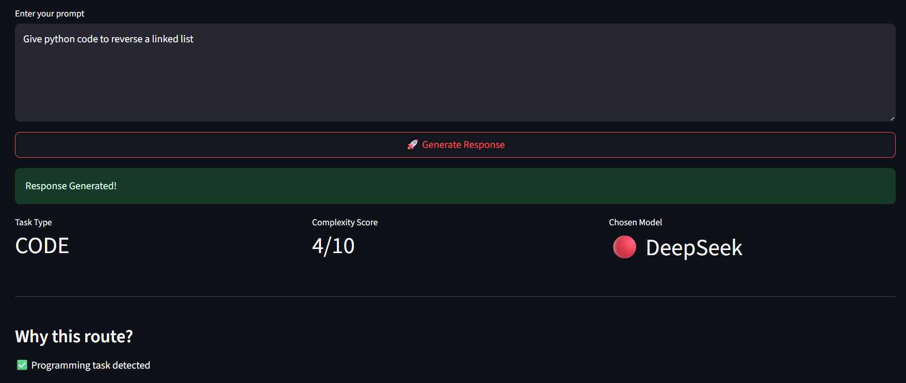
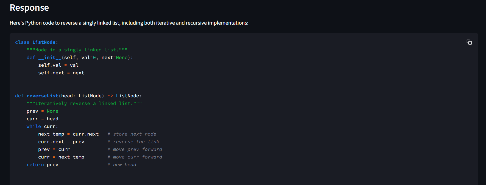
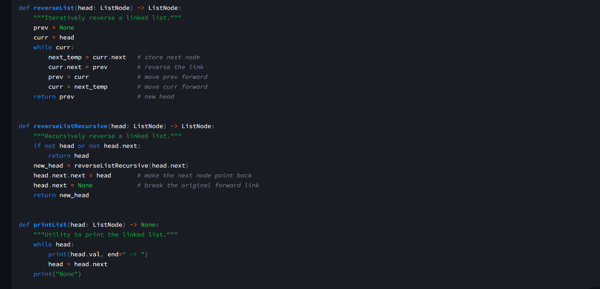
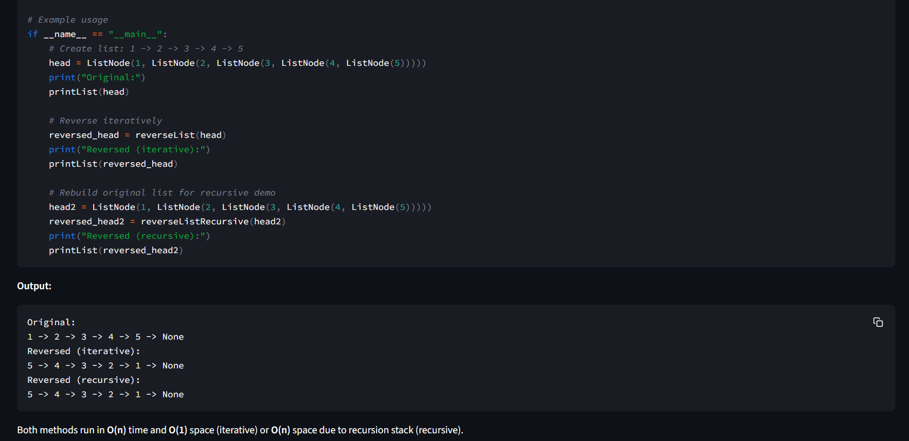

#  Smart Route AI

> Hybrid Token-Efficient LLM Router built for the **AMD Developer Hackathon ACT II – Track 1**

Smart Route AI intelligently routes prompts to either a **local lightweight LLM (Qwen2.5-0.5B-Instruct)** or a **remote high-performance LLM (DeepSeek V4 Pro via Fireworks AI)** based on task complexity.

Instead of sending every prompt to an expensive cloud model, the router performs lightweight task analysis and chooses the most suitable model, reducing inference cost while maintaining response quality.

---

##  Live Demo

🌐 **Streamlit**

https://smartrouteai-abfp46dmaiemwjnupjht6k.streamlit.app/

---

## 🐳 Docker

Docker Hub

```
noobmaster732/smart-route-ai:latest
```

Pull image

```bash
docker pull noobmaster732/smart-route-ai:latest
```

Run

```bash
docker run --env-file .env noobmaster732/smart-route-ai:latest
```

---

# ✨ Features

- Hybrid Local + Remote LLM Routing
- Complexity-aware prompt classification
- Local inference using Qwen2.5-0.5B
- Remote inference using DeepSeek V4 Pro
- Token-efficient architecture
- Interactive Streamlit interface
- Dockerized deployment
- Automatic fallback mechanism

---

# 🌐 Demo

## Home Page



---

## Example 1 — Simple Factual Question

Prompt

```
What is the capital of France?
```

### Routing Decision

- Task Type: FACTUAL
- Complexity: 0/10
- Model: Local Qwen



Simple factual prompts remain on the local model, eliminating unnecessary API calls.

---

## Example 2 — Programming Task

Prompt

```
Give Python code to reverse a linked list.
```

### Routing Decision

- Task Type: CODE
- Complexity: 4/10
- Model: DeepSeek V4 Pro



Programming tasks require stronger reasoning and therefore are automatically routed to the remote model.

---

## Generated Response

The remote model returns complete working code.



---

## Generated Output

The returned implementation includes documentation, examples and complexity analysis.



---

## Code Preview



---

#  Architecture

```
                  User Prompt
                       │
                       ▼
              Task Classification
                       │
                       ▼
             Complexity Estimation
                       │
                       ▼
             Intelligent Router
          ┌────────────┴────────────┐
          │                         │
          ▼                         ▼
 Local Qwen2.5-0.5B         DeepSeek V4 Pro
 (Local CPU Inference)     (Fireworks AI API)
          │                         │
          └────────────┬────────────┘
                       ▼
                Final Response
```

---

#  Routing Strategy

The router computes a lightweight complexity score using multiple heuristics.

Factors considered include:

- Programming tasks
- Mathematical reasoning
- Logical reasoning
- Prompt length
- Formatting constraints

| Prompt Type | Selected Model |
|-------------|----------------|
| Factual Questions | 🟢 Local |
| Short Summaries | 🟢 Local |
| Named Entity Recognition | 🟢 Local |
| Sentiment Analysis | 🟢 Local |
| Code Generation | 🔴 Remote |
| Mathematical Problems | 🔴 Remote |
| Complex Reasoning | 🔴 Remote |

---

# 📂 Project Structure

```
smart_route_ai/

│── app.py
│── Dockerfile
│── requirements.txt
│── README.md

├── src/
│   ├── main.py
│   ├── router.py
│   ├── classifier.py
│   ├── local_model.py
│   ├── fireworks_client.py
│   └── config.py

├── input/
│   └── tasks.json

├── output/

├── images/
```

---

# 🛠 Tech Stack

- Python
- Streamlit
- Hugging Face Transformers
- Qwen2.5-0.5B-Instruct
- DeepSeek V4 Pro
- Fireworks AI
- Docker
- OpenAI SDK
- PyTorch

---

#  Running Locally

Clone

```bash
git clone https://github.com/raiankur-dev/smart_route_ai.git

cd smart_route_ai
```

Install

```bash
pip install -r requirements.txt
```

Create `.env`

```
FIREWORKS_API_KEY=YOUR_FIREWORKS_API_KEY
HF_TOKEN=YOUR_HUGGINGFACE_TOKEN
```

Run

```bash
streamlit run app.py
```

---

#  Future Improvements

- ML-based routing instead of heuristic rules
- Adaptive routing using confidence estimation
- Cost-aware dynamic routing
- Multi-model support
- Benchmarking on larger evaluation datasets

---

#  Team

Developed for the **AMD Developer Hackathon ACT II – Track 1**

Team Name: **(Add your team name here)**

---

#  License

This project was developed for the AMD Developer Hackathon ACT II.